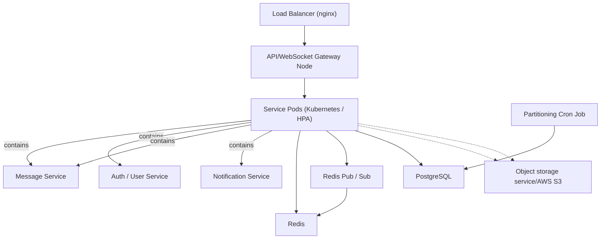
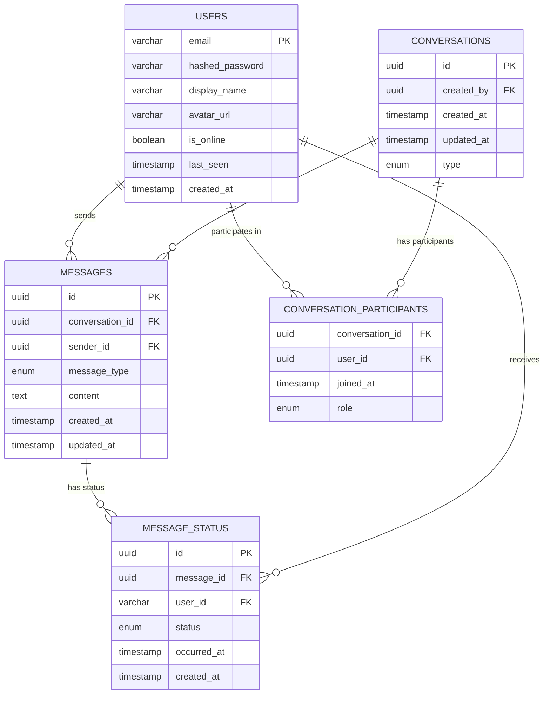

# System Design

## Infrastructure



```mermaid
flowchart TB
    LB["Load Balancer (nginx)"] --> API["API/WebSocket Gateway Node"]
    API --> Pods["Service Pods (Kubernetes / HPA)"]
    
    Pods -->|contains| Conv["Conversation Service"]
    Pods -->|contains| Auth["Auth / User Service"]
    Pods -->|contains| Conv["Message Service"]
    Pods -->|contains| RTC["Notification Service"]
    
    Pods --> Redis["Redis"]
    Pods --> PS["Redis Pub / Sub"]
    PS --> Redis
    
    Cron["Partitioning Cron Job"] --> PG["PostgreSQL"]
    Pods --> PG
    
    Pods -.-> OS["OpenSearch"]
    Pods -.-> OS["Object storage service/AWS S3"]

```
### System bottlenecks & Solutions

| Bottleneck           | Solution                                  | Trade-off |
|----------------------|-------------------------------------------|--------|
| Database connections | Connection pooling                        | add a little complexity   |
| WebSocket memory     | Connection limits + sticky sessions       | introduce gateway   |
| Message delivery     | Message queues + async processing         | Medium |
| Database writes      | Write batching + partitioning             | Medium |
| Cache invalidation   | Smart caching strategies                  | Low    |

We use Kubernetes for backend service instead of serverless functions to keep high performance and cost saving. We don't use salesforce cloud as it cannot efficient scale up.

To support high quality code, we choose typescript for both backend and frontend.
We use REST API for auth, user and conversation management, use websocket for realtime chat, so we can keep right performance for different scenarios. To reduce complexity, we introduce gateway to handle both REST and websocket and redirect to different services.

### How to scale to 10K concurrent users

- use DB partitioning by time and connection pooling allow to scale up db operators to support conversation query for massive users without additional change.
- auto scale up gateway pod number to support more concurrent connections by websocket, also keep all participants in same conversion to same pod to improve performance.
- use connection limit and api rate limit to shield the system.


### Database and Data Schema
We use Postgres here as it supports partitioning and be well supported by public cloud. We can use other DB that support partitioning as well. We don't use NOSQL DB here


```mermaid
erDiagram
    USERS {
        varchar email PK
        varchar hashed_password
        varchar display_name
        varchar avatar_url
        boolean is_online
        timestamp last_seen
        timestamp created_at
    }
    CONVERSATIONS {
        uuid id PK
        uuid created_by FK
        timestamp created_at
        timestamp updated_at
        enum type
    }
    MESSAGES {
        uuid id PK
        uuid conversation_id FK
        uuid sender_id FK
        enum message_type
        text content
        timestamp created_at
        timestamp updated_at
    }
    CONVERSATION_PARTICIPANTS {
        uuid conversation_id FK
        uuid user_id FK
        timestamp joined_at
        enum role
    }
    MESSAGE_STATUS {
        uuid id PK
        uuid message_id FK
        varchar user_id FK
        enum status
        timestamp occurred_at
        timestamp created_at
    }

    USERS ||--o{ MESSAGES                  : "sends"
    CONVERSATIONS ||--o{ MESSAGES           : "contains"
    USERS ||--o{ CONVERSATION_PARTICIPANTS : "participates in"
    CONVERSATIONS ||--o{ CONVERSATION_PARTICIPANTS : "has participants"
    MESSAGES ||--o{ MESSAGE_STATUS         : "has status"
    USERS ||--o{ MESSAGE_STATUS            : "receives"
```
### Backend
API Endpoints:
-   `POST /v1/auth/register`, register action, return use public info, no protected
    
-   `POST /v1/auth/login`, login action, return JTW token, no protected
    
-   `GET /v1/users/me`, user query api, protected
    
-   `GET /v1/conversations`, conversation collection query api, protected
    
-   `POST /v1/conversations`, new conversation api, protected,
    
-   `GET /v1/conversations/:id/messages`, message collection query api, protected
    
-   `POST /v1/conversations/:id/messages`, new message api, protected
    
-   `WebSocket /ws` (for real-time updates), real-time message delivery, protected

- api name: all api use /v1/service/action, /v1/service/collect, /v1/service/collect/item format.
- all collection query api supports pagination
- all protect api needs to pass JWT token to auth. We use JWT token instead of session to keep API as stateless. 
- all API use http error for error case and return error object.
- use prisma to simplify DB operation in code and schema management.

### Frontend
For frontend, we will use LWC(Lightning Web Components) so we can reuse existed components.

### Code structure
We use monorepo structure with shared packages.
```
chatflow/
├── .github/                     # TODO: GitHub Actions CI/CD
│   └── workflows/
│       ├── ci.yml
│       ├── deploy-staging.yml
│       └── deploy-production.yml
├── .gitlab-ci.yml              # TODO: GitLab CI/CD (alternative)
├── docker/                     # Docker configurations
│   ├── nginx/ # TODO:
│   │   ├── Dockerfile
│   │   ├── nginx.conf
│   │   └── nginx.dev.conf
│   └── postgres/
│       └── Dockerfile
├── k8s/                        # TODO: Kubernetes manifests
│   ├── base/
│   │   ├── namespace.yaml
│   │   ├── configmap.yaml
│   │   ├── secrets.yaml
│   │   ├── postgres.yaml
│   │   ├── redis.yaml
│   │   ├── backend.yaml
│   │   ├── frontend.yaml
│   │   └── nginx.yaml
│   ├── staging/
│   │   ├── kustomization.yaml
│   │   └── ingress.yaml
│   └── production/
│       ├── kustomization.yaml
│       ├── ingress.yaml
│       └── hpa.yaml
├── scripts/                    # TODO: Utility scripts
│   ├── setup.sh
│   ├── build.sh
│   ├── deploy.sh
│   └── migrate.sh
├── shared/      # shared code
│   ├── src/
│   ├── package.json
│   └── tsconfig.json
├── prisma/      # DB schema
│   └── migrations/
├── backend/
│   ├── src/
│   ├── Dockerfile
│   ├── package.json
│   └── tsconfig.json
└── frontend/   # simple frontend
│   ├── src/
│   ├── package.json
│   └── tsconfig.json
├── docker-compose.yml          # Development environment
├── docker-compose.prod.yml     # Production environment
├── package.json                # Root package.json
├── tsconfig.json              # Root TypeScript config
├── .env.example               # Environment variables template
└── README.md

```