# System Design

## Infrastructure


### System bottlenecks & Solutions

| Bottleneck           | Solution                                  | Trade-off |
|----------------------|-------------------------------------------|--------|
| Cold starts | Cloud Run minimum instances + warm-up requests | Slight cost increase for consistent performance |
| WebSocket memory     | Connection limits + Cloud Run auto-scaling       | Stateful connections need session affinity   |
| Message delivery     | Cloud Pub/Sub + async processing         | Low |
| Document reads      | Firestore caching + efficient queries             | Low |
| Real-time updates   | Firestore real-time listeners + Pub/Sub fan-out  | Low    |

We use Cloud Run for backend services instead of Kubernetes to achieve true serverless scaling and cost optimization. This eliminates infrastructure management overhead while maintaining high performance.

To support high quality code, we choose TypeScript for both backend and frontend.
We use REST API for auth, user and conversation management, use WebSocket for real-time chat, so we can maintain optimal performance for different scenarios. We use Cloud Run with automatic scaling to handle both REST and WebSocket traffic efficiently.

### How to scale to 10K concurrent users

- Firestore automatically handles horizontal scaling without manual sharding or partitioning - queries scale seamlessly as document count grows.
- Cloud Run auto-scales instances based on demand, supporting thousands of concurrent WebSocket connections with automatic load balancing.
- Cloud Pub/Sub provides massive fan-out capability (millions of messages/second) for real-time message delivery.
- Use Firestore composite indexes and query optimization for efficient document retrieval at scale.
- Implement connection limits and API rate limiting via Cloud Endpoints or API Gateway to protect system resources.


### Database and Data Schema
We use Cloud Firestore as a serverless NoSQL document database that automatically scales and provides real-time updates. This eliminates the need for manual partitioning, connection pooling, and infrastructure management while reducing operational costs significantly.

```mermaid
graph TB
    subgraph "Firestore Collections"
        Users["👤 users/"]
        Conversations["💬 conversations/"]
    end
    
    subgraph "User Document Structure"
        UserDoc["📄 users/{email}<br/>• hashedPassword: string<br/>• displayName: string<br/>• avatarUrl?: string<br/>• isOnline: boolean<br/>• lastSeen: timestamp<br/>• createdAt: timestamp"]
    end
    
    subgraph "Conversation Document Structure"
        ConvDoc["📄 conversations/{convId}<br/>• id: conv_{timestamp}_{random}<br/>• createdBy: email<br/>• type: DIRECT | GROUP<br/>• participantEmails: string[]<br/>• createdAt: timestamp<br/>• updatedAt: timestamp"]
    end
    
    subgraph "Subcollections"
        Participants["👥 participants/{email}<br/>• userId: email<br/>• joinedAt: timestamp<br/>• role: ADMIN | MEMBER"]
        Messages["📝 messages/{msgId}<br/>• id: msg_{timestamp}_{random}<br/>• conversationId: string<br/>• senderId: email<br/>• senderDisplayName: string<br/>• messageType: TEXT | IMAGE | FILE<br/>• content: string<br/>• createdAt: timestamp<br/>• updatedAt: timestamp"]
        MessageStatus["📊 status/{email}<br/>• userId: email<br/>• status: SENT | DELIVERED | READ | FAILED<br/>• sentAt: timestamp<br/>• deliveredAt?: timestamp<br/>• readAt?: timestamp"]
    end
    
    Users --> UserDoc
    Conversations --> ConvDoc
    ConvDoc --> Participants
    ConvDoc --> Messages
    Messages --> MessageStatus
```


### Backend
API Endpoints:
-   `POST /v1/auth/register`, register action, return user public info, no protected
    
-   `POST /v1/auth/login`, login action, return JWT token, no protected
    
-   `GET /v1/users/me`, user query api, protected
    
-   `GET /v1/conversations`, conversation collection query api, protected
    
-   `POST /v1/conversations`, new conversation api, protected
    
-   `GET /v1/conversations/:convId/messages`, message collection query api, protected
    
-   `POST /v1/conversations/:convId/messages`, new message api, protected
    
-   `GET /v1/conversations/:convId/messages/:msgId`, individual message query, protected
    
-   `PUT /v1/conversations/:convId/messages/:msgId`, update message api, protected
    
-   `DELETE /v1/conversations/:convId/messages/:msgId`, delete message api, protected
    
-   `WebSocket /ws` (for real-time updates), real-time message delivery, protected

**API Design Principles:**
- API naming: all APIs use `/v1/service/action`, `/v1/service/collection`, `/v1/service/collection/item` format
- All collection query APIs support pagination with `page` and `limit` parameters
- All protected APIs require JWT token for authentication - stateless design for serverless scaling
- All APIs use HTTP status codes for success/error cases and return structured error objects
- Use Firebase Admin SDK for Firestore operations and Cloud Pub/Sub for real-time messaging
- Conversation IDs: `conv_{timestamp}_{randomString}` format for better performance
- Message IDs: `msg_{timestamp}_{randomString}` format for chronological ordering

### Frontend
For frontend, we will use LWC(Lightning Web Components) so we can reuse existed components.

### Code structure
We use monorepo structure with shared packages.
```
chatflow/
├── .github/                     # TODO: GitHub Actions CI/CD
│   └── workflows/
│       ├── ci.yml
│       ├── deploy-staging.yml
│       └── deploy-production.yml
├── .gitlab-ci.yml              # TODO: GitLab CI/CD (alternative)
├── docker/                     # Docker configurations
│   ├── nginx/ # TODO:
│   │   ├── Dockerfile
│   │   ├── nginx.conf
│   │   └── nginx.dev.conf
│   └── postgres/
│       └── Dockerfile
├── k8s/                        # TODO: Kubernetes manifests
│   ├── base/
│   │   ├── namespace.yaml
│   │   ├── configmap.yaml
│   │   ├── secrets.yaml
│   │   ├── postgres.yaml
│   │   ├── redis.yaml
│   │   ├── backend.yaml
│   │   ├── frontend.yaml
│   │   └── nginx.yaml
│   ├── staging/
│   │   ├── kustomization.yaml
│   │   └── ingress.yaml
│   └── production/
│       ├── kustomization.yaml
│       ├── ingress.yaml
│       └── hpa.yaml
├── scripts/                    # TODO: Utility scripts
│   ├── setup.sh
│   ├── build.sh
│   ├── deploy.sh
│   └── migrate.sh
├── shared/      # shared code
│   ├── src/
│   ├── package.json
│   └── tsconfig.json
├── prisma/      # DB schema
│   └── migrations/
├── backend/
│   ├── src/
│   ├── Dockerfile
│   ├── package.json
│   └── tsconfig.json
└── frontend/   # simple frontend
│   ├── src/
│   ├── package.json
│   └── tsconfig.json
├── docker-compose.yml          # Development environment
├── docker-compose.prod.yml     # Production environment
├── package.json                # Root package.json
├── tsconfig.json              # Root TypeScript config
├── .env.example               # Environment variables template
└── README.md

```